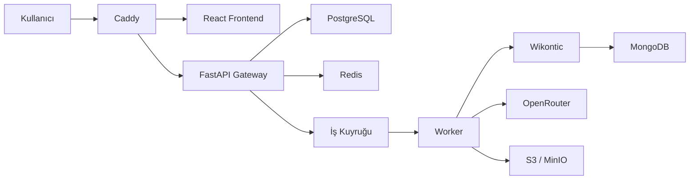

# Knowledge Graph Production

Metin, PDF ve web kaynaklarından bilgi grafiği çıkarmak; üretilen triple'ları RAG ve çoklu model değerlendirmesiyle doğrulamak; doğrulanmış bir triple veri seti oluşturmak için geliştirilen platformdur.

## Mevcut durum

- React frontend Caddy üzerinden çalışıyor.
- FastAPI gateway, frontend API sözleşmesini sağlıyor.
- Wikontic ayrı bir servis olarak çalışıyor.
- OpenRouter üzerinden model çağrısı yapılabiliyor.
- MongoDB Atlas Local üzerinde Wikontic ontology ve embedding indeksleri bulunuyor.
- Docker Compose ile mevcut sistem ayağa kaldırılabiliyor.

## Hedef mimari



Teknoloji kararları:

- Frontend: mevcut React arayüzü
- Reverse proxy: Caddy
- API: FastAPI gateway
- Kalıcı uygulama verileri: PostgreSQL
- Session, rate limit, cache ve queue: Redis
- Ontology ve vector indeksleri: MongoDB
- Dosya deposu: geliştirmede Docker volume, üretimde S3/MinIO
- Worker ve zamanlanmış görevler: Celery ve Celery Beat
- LLM sağlayıcısı: OpenRouter

## Genel TODO

### 1. Kullanıcı girişi ve hesap oluşturma

Platform anonymous-first çalışacaktır. Kullanıcı giriş yapmadan triple çıkarabilecek ve aynı tarayıcıdan döndüğünde çalışma alanını görebilecektir.

- [x] Anonim ziyaretçi cookie'si oluşturma
- [ ] Anonim çalışma alanı oluşturma
- [x] Kayıt, giriş, çıkış ve mevcut kullanıcı endpointleri
- [ ] E-posta doğrulama
- [ ] Şifre sıfırlama
- [x] Şifreleri Argon2id ile hashleme
- [x] HttpOnly server-side session kullanma
- [ ] Anonim geçmişi kayıtlı hesaba aktarma
- [ ] Aktif oturumları görüntüleme ve kapatma
- [ ] Hesap ve kullanıcı verilerini silme
- [ ] Google/GitHub OAuth desteğini sonraki sürümde değerlendirme

### 2. Middleware

- [ ] Her isteğe request ID verme
- [ ] Request ID'yi downstream servislere aktarma
- [ ] Güvenli JSON access ve hata logları
- [ ] Merkezi ve standart hata cevapları
- [ ] API anahtarı, cookie ve doküman içeriğini loglardan temizleme
- [ ] Boş veya geçersiz içerikleri reddetme
- [ ] Request boyutu sınırı
- [ ] Environment tabanlı CORS ve Origin kontrolü
- [x] İmzalı anonim ziyaretçi cookie'si
- [x] Session doğrulama ve kullanıcı context'i
- [ ] Güvenli upstream timeout yönetimi
- [ ] Redis tabanlı rate limit
- [ ] Extraction concurrency limiti
- [ ] Hash tabanlı duplicate kontrolü
- [ ] Devam eden aynı işlemin tekrar başlatılmasını engelleme
- [ ] Unit ve integration testleri

Temel middleware tamamlandıktan sonra Redis tabanlı rate limit ve duplicate önleme eklenecektir. Duplicate anahtarı yalnızca metinden değil; model, KG yöntemi, prompt, embedding modeli, ontology dili ve pipeline sürümünden üretilecektir.

### 3. Frontend

Mevcut tasarım korunacak ve yeni backend yeteneklerine bağlanacaktır.

- [x] Anonim oturum göstergesi
- [x] Giriş ve hesap oluşturma ekranları
- [ ] Anonim geçmişi hesaba aktarma akışı
- [ ] Text, PDF ve URL girişi
- [ ] Extraction job durumunu gösterme
- [ ] Bekliyor, çalışıyor, tamamlandı ve hata durumları
- [ ] Geçmiş doküman ve extraction listesi
- [ ] Triple detay ve kaynak kanıt görünümü
- [ ] RAG doğrulama ve consensus sonuçları
- [ ] Triple düzenleme, reddetme ve onaylama
- [ ] Sonuç indirme ve dışa aktarma
- [ ] Kullanım kotası ve model maliyet göstergesi
- [ ] Hatalarda request ID gösterme
- [ ] Veri kullanımı ve gizlilik bilgilendirmesi

### 4. Backend

Mevcut gateway korunacak ve modüler bir yapıya ayrılacaktır.

- [ ] `auth`, `documents`, `jobs`, `triples` ve `models` route'ları
- [ ] Text, PDF ve URL girişlerini ortak doküman modeline dönüştürme
- [ ] Doküman hash'i ve pipeline fingerprint üretme
- [ ] Extraction job oluşturma
- [ ] Wikontic adapter katmanı
- [ ] OpenRouter provider katmanı
- [ ] Model ve prompt ayarlarını doğrulama
- [ ] Triple ve provenance kaydı
- [ ] Candidate, verified ve rejected durumları
- [ ] RAG doğrulama akışı
- [ ] Çoklu model consensus ve final judge
- [ ] Global KG'ye yayınlama kontrolü
- [ ] API sürümleme
- [ ] Mevcut senkron `/api/extract` endpoint'i için geçiş dönemi

### 5. Veritabanları

PostgreSQL uygulamanın ana kayıt kaynağı olacaktır. Redis geçici veri ve koordinasyon; MongoDB ise Wikontic ontology ve vector indeksleri için kullanılacaktır.

PostgreSQL tabloları:

- [ ] `users`
- [ ] `anonymous_visitors`
- [ ] `sessions`
- [ ] `workspaces`
- [ ] `documents`
- [ ] `extraction_jobs`
- [ ] `triples`
- [ ] `triple_evidence`
- [ ] `verification_results`
- [ ] `pipeline_runs`
- [ ] `usage_records`
- [ ] `consent_records`

Altyapı işleri:

- [x] PostgreSQL Docker servisi
- [x] Redis Docker servisi
- [x] Alembic migration sistemi
- [ ] İndeksler ve unique constraint'ler
- [ ] Yedekleme politikası
- [ ] Veri silme ve saklama süreleri
- [ ] MongoDB profil ve index sağlık kontrolleri
- [ ] S3/MinIO dosya deposu entegrasyonu

### 6. Worker ve cron işlemleri

Uzun süren işlemler API container'ında çalıştırılmayacaktır.

Worker kuyrukları:

- [ ] `ingestion`: PDF, OCR, scraping ve metin temizleme
- [ ] `chunking`: parent-child chunk üretimi
- [ ] `extraction`: triple çıkarma
- [ ] `verification`: RAG doğrulama
- [ ] `consensus`: çoklu model değerlendirmesi
- [ ] `publishing`: doğrulanmış triple'ları global KG'ye aktarma

Zamanlanmış görevler:

- [ ] Yarım kalan job'ları tespit etme
- [ ] Başarısız job'ları sınırlı tekrar deneme
- [ ] Süresi geçmiş session ve cache kayıtlarını temizleme
- [ ] Eski geçici dosyaları temizleme
- [ ] OpenRouter model listesini güncelleme
- [ ] Kullanım ve maliyet raporları üretme
- [ ] Candidate triple'ları periyodik benchmark'tan geçirme
- [ ] MongoDB ve embedding profillerinin sağlık kontrolü

Her job idempotent olmalıdır. Worker yeniden başlatıldığında aynı model çağrısı gereksiz yere tekrarlanmamalıdır.

## Önerilen geliştirme sırası

1. PostgreSQL ve Redis temeli
2. Temel middleware
3. Anonim ziyaretçi ve kullanıcı oturumları
4. Doküman, job ve triple backend API'leri
5. Worker ve queue sistemi
6. Frontend'in async job sistemine bağlanması
7. Duplicate önleme ve rate limit
8. RAG doğrulama ve çoklu model consensus
9. Cron görevleri, gözlemlenebilirlik ve üretim güvenliği

## Hesap API'si

Platform giriş zorunluluğu olmadan çalışır. İlk API isteğinde imzalı bir `kg_visitor` cookie'si oluşturulur. Kullanıcı kayıt olduğunda bu anonim ziyaretçi kullanıcı hesabına bağlanır ve Redis üzerinde `kg_session` oturumu açılır.

```text
GET  /api/auth/me
POST /api/auth/register
POST /api/auth/login
POST /api/auth/logout
```

Kayıt isteği:

```json
{
  "email": "user@example.com",
  "password": "en-az-10-karakter",
  "display_name": "Kullanıcı Adı"
}
```

Giriş isteği:

```json
{
  "email": "user@example.com",
  "password": "en-az-10-karakter"
}
```

Cookie'ler `HttpOnly` ve `SameSite=Lax` olarak ayarlanır. Üretim ortamında HTTPS kullanın, güçlü bir secret üretin ve aşağıdaki değerleri değiştirin:

```bash
openssl rand -hex 32
```

```env
AUTH_COOKIE_SECRET=uretilen-deger
AUTH_COOKIE_SECURE=true
AUTH_COOKIE_DOMAIN=example.com
```

PostgreSQL şeması backend başlarken Alembic tarafından otomatik uygulanır. Redis yalnızca giriş oturumlarını tutar; anonim ziyaretçi kimliği PostgreSQL'de kalıcıdır.

## Çalıştırma

Gerekenler: Docker Desktop ve OpenRouter API anahtarı.

İlk kurulum:

```bash
cp .env.example .env
```

`.env` dosyasına OpenRouter anahtarını yazın:

```env
OPENROUTER_API_KEY=your_api_key
```

RAG verilerini bir kez hazırlayın:

```bash
docker compose --profile setup run --rm wikontic-init
```

Frontend ve backend servislerini başlatın:

```bash
docker compose up -d --build
```

Uygulama adresi: http://localhost:3000

Servisleri durdurun:

```bash
docker compose down
```

Sonraki çalıştırmalarda:

```bash
docker compose up -d
```
