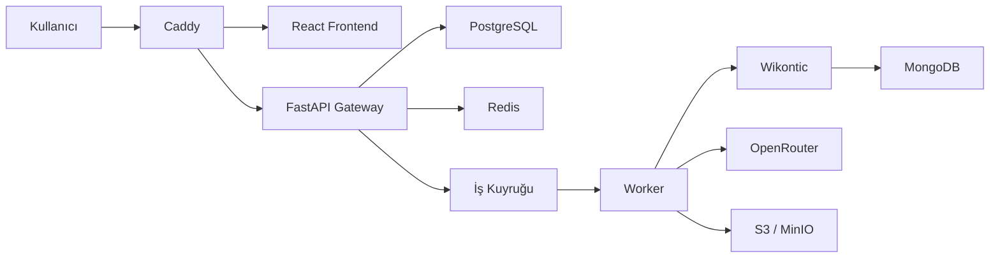

# Knowledge Graph Production

Metin, PDF ve web kaynaklarından bilgi grafiği çıkarmak; üretilen triple'ları RAG ve çoklu model değerlendirmesiyle doğrulamak; doğrulanmış bir triple veri seti oluşturmak için geliştirilen platformdur.

## Mevcut durum

- React frontend Caddy üzerinden çalışıyor.
- FastAPI gateway, frontend API sözleşmesini sağlıyor.
- Wikontic ayrı bir servis olarak çalışıyor.
- OpenRouter üzerinden model çağrısı yapılabiliyor.
- MongoDB Atlas Local üzerinde Wikontic ontology ve embedding indeksleri bulunuyor.
- Docker Compose ile mevcut sistem ayağa kaldırılabiliyor.

## Hedef mimari



Teknoloji kararları:

- Frontend: mevcut React arayüzü
- Reverse proxy: Caddy
- API: FastAPI gateway
- Kalıcı uygulama verileri: PostgreSQL
- Session, rate limit, cache ve queue: Redis
- Ontology ve vector indeksleri: MongoDB
- Dosya deposu: geliştirmede Docker volume, üretimde S3/MinIO
- Worker ve zamanlanmış görevler: Celery ve Celery Beat
- LLM sağlayıcısı: OpenRouter

## Genel TODO

### 1. Kullanıcı girişi ve hesap oluşturma

Platform anonymous-first çalışacaktır. Kullanıcı giriş yapmadan triple çıkarabilecek ve aynı tarayıcıdan döndüğünde çalışma alanını görebilecektir.

- [x] Anonim ziyaretçi cookie'si oluşturma
- [x] Anonim çalışma alanı oluşturma
- [x] Kayıt, giriş, çıkış ve mevcut kullanıcı endpointleri
- [ ] E-posta doğrulama
- [ ] Şifre sıfırlama
- [x] Şifreleri Argon2id ile hashleme
- [x] HttpOnly server-side session kullanma
- [x] Anonim geçmişi kayıtlı hesaba aktarma
- [ ] Aktif oturumları görüntüleme ve kapatma
- [ ] Hesap ve kullanıcı verilerini silme
- [ ] Google/GitHub OAuth desteğini sonraki sürümde değerlendirme

### 2. Middleware

- [x] Her isteğe request ID verme
- [x] Request ID'yi downstream servislere aktarma
- [x] Güvenli JSON access ve hata logları
- [x] Merkezi ve standart hata cevapları
- [x] API anahtarı, cookie ve doküman içeriğini loglardan temizleme
- [x] Boş veya geçersiz içerikleri reddetme
- [x] Request boyutu sınırı
- [x] Environment tabanlı CORS ve Origin kontrolü
- [x] İmzalı anonim ziyaretçi cookie'si
- [x] Session doğrulama ve kullanıcı context'i
- [x] Güvenli upstream timeout yönetimi
- [x] Redis tabanlı rate limit
- [ ] Extraction concurrency limiti
- [x] Hash tabanlı duplicate kontrolü
- [x] Devam eden aynı işlemin tekrar başlatılmasını engelleme
- [x] Unit ve integration testleri

Temel middleware ve rate limit tamamlandı. Duplicate kontrolü doküman ve job modeliyle birlikte eklendi: doküman içeriği SHA-256 ile hashlenip aynı çalışma alanında tekrar kaydedilmiyor, extraction job'ları ise model, KG yöntemi, prompt, embedding modeli, ontology dili ve pipeline sürümünden üretilen bir fingerprint ile eşleşiyor; devam eden veya tamamlanmış aynı iş varsa yeniden kullanılıyor.

### 3. Frontend

Mevcut tasarım korunacak ve yeni backend yeteneklerine bağlanacaktır.

- [x] Anonim oturum göstergesi
- [x] Giriş ve hesap oluşturma ekranları
- [ ] Anonim geçmişi hesaba aktarma akışı
- [ ] Text, PDF ve URL girişi
- [ ] Extraction job durumunu gösterme
- [ ] Bekliyor, çalışıyor, tamamlandı ve hata durumları
- [ ] Geçmiş doküman ve extraction listesi
- [ ] Triple detay ve kaynak kanıt görünümü
- [ ] RAG doğrulama ve consensus sonuçları
- [ ] Triple düzenleme, reddetme ve onaylama
- [ ] Sonuç indirme ve dışa aktarma
- [ ] Kullanım kotası ve model maliyet göstergesi
- [ ] Hatalarda request ID gösterme
- [ ] Veri kullanımı ve gizlilik bilgilendirmesi

### 4. Backend

Mevcut gateway korunacak ve modüler bir yapıya ayrılacaktır.

- [ ] `auth`, `documents`, `jobs`, `triples` ve `models` route'ları (auth, documents ve extraction-jobs tamamlandı; triples ve models bekliyor)
- [ ] Text, PDF ve URL girişlerini ortak doküman modeline dönüştürme (ilk aşamada yalnızca düz metin destekleniyor)
- [x] Doküman hash'i ve pipeline fingerprint üretme
- [x] Extraction job oluşturma
- [ ] Wikontic adapter katmanı
- [ ] OpenRouter provider katmanı
- [ ] Model ve prompt ayarlarını doğrulama
- [ ] Triple ve provenance kaydı
- [ ] Candidate, verified ve rejected durumları
- [ ] RAG doğrulama akışı
- [ ] Çoklu model consensus ve final judge
- [ ] Global KG'ye yayınlama kontrolü
- [ ] API sürümleme
- [ ] Mevcut senkron `/api/extract` endpoint'i için geçiş dönemi

### 5. Veritabanları

PostgreSQL uygulamanın ana kayıt kaynağı olacaktır. Redis geçici veri ve koordinasyon; MongoDB ise Wikontic ontology ve vector indeksleri için kullanılacaktır.

PostgreSQL tabloları:

- [x] `users`
- [x] `anonymous_visitors`
- [ ] `sessions`
- [x] `workspaces`
- [x] `documents`
- [x] `extraction_jobs`
- [ ] `triples`
- [ ] `triple_evidence`
- [ ] `verification_results`
- [ ] `pipeline_runs`
- [ ] `usage_records`
- [ ] `consent_records`

Altyapı işleri:

- [x] PostgreSQL Docker servisi
- [x] Redis Docker servisi
- [x] Alembic migration sistemi
- [ ] İndeksler ve unique constraint'ler
- [ ] Yedekleme politikası
- [ ] Veri silme ve saklama süreleri
- [ ] MongoDB profil ve index sağlık kontrolleri
- [ ] S3/MinIO dosya deposu entegrasyonu

### 6. Worker ve cron işlemleri

Uzun süren işlemler API container'ında çalıştırılmayacaktır.

Worker kuyrukları:

- [ ] `ingestion`: PDF, OCR, scraping ve metin temizleme
- [ ] `chunking`: parent-child chunk üretimi
- [ ] `extraction`: triple çıkarma
- [ ] `verification`: RAG doğrulama
- [ ] `consensus`: çoklu model değerlendirmesi
- [ ] `publishing`: doğrulanmış triple'ları global KG'ye aktarma

Zamanlanmış görevler:

- [ ] Yarım kalan job'ları tespit etme
- [ ] Başarısız job'ları sınırlı tekrar deneme
- [ ] Süresi geçmiş session ve cache kayıtlarını temizleme
- [ ] Eski geçici dosyaları temizleme
- [ ] OpenRouter model listesini güncelleme
- [ ] Kullanım ve maliyet raporları üretme
- [ ] Candidate triple'ları periyodik benchmark'tan geçirme
- [ ] MongoDB ve embedding profillerinin sağlık kontrolü

Her job idempotent olmalıdır. Worker yeniden başlatıldığında aynı model çağrısı gereksiz yere tekrarlanmamalıdır.

## Önerilen geliştirme sırası

1. PostgreSQL ve Redis temeli
2. Temel middleware
3. Anonim ziyaretçi ve kullanıcı oturumları
4. Doküman, job ve triple backend API'leri
5. Worker ve queue sistemi
6. Frontend'in async job sistemine bağlanması
7. Duplicate önleme ve rate limit
8. RAG doğrulama ve çoklu model consensus
9. Cron görevleri, gözlemlenebilirlik ve üretim güvenliği

## Hesap API'si

Platform giriş zorunluluğu olmadan çalışır. İlk API isteğinde imzalı bir `kg_visitor` cookie'si oluşturulur. Kullanıcı kayıt olduğunda bu anonim ziyaretçi kullanıcı hesabına bağlanır ve Redis üzerinde `kg_session` oturumu açılır.

```text
GET  /api/auth/me
POST /api/auth/register
POST /api/auth/login
POST /api/auth/logout
```

Kayıt isteği:

```json
{
  "email": "user@example.com",
  "password": "en-az-10-karakter",
  "display_name": "Kullanıcı Adı"
}
```

Giriş isteği:

```json
{
  "email": "user@example.com",
  "password": "en-az-10-karakter"
}
```

Cookie'ler `HttpOnly` ve `SameSite=Lax` olarak ayarlanır. Üretim ortamında HTTPS kullanın, güçlü bir secret üretin ve aşağıdaki değerleri değiştirin:

```bash
openssl rand -hex 32
```

```env
AUTH_COOKIE_SECRET=uretilen-deger
AUTH_COOKIE_SECURE=true
AUTH_COOKIE_DOMAIN=example.com
```

PostgreSQL şeması backend başlarken Alembic tarafından otomatik uygulanır. Redis yalnızca giriş oturumlarını tutar; anonim ziyaretçi kimliği PostgreSQL'de kalıcıdır.

## Doküman ve extraction job API'si

Her anonim ziyaretçi veya kullanıcı için otomatik olarak bir çalışma alanı (`workspace`) oluşturulur. Kullanıcı giriş yaptığında, anonim oturumdaki çalışma alanı otomatik olarak hesaba taşınır.

```text
POST /api/documents
GET  /api/documents
GET  /api/documents/{id}

POST /api/extraction-jobs
GET  /api/extraction-jobs/{id}
```

Doküman oluşturma isteği:

```json
{
  "text": "İşlenecek düz metin",
  "title": "Opsiyonel başlık"
}
```

Gönderilen metin normalize edilir (Unicode NFC, satır sonu ve boşluk temizliği) ve SHA-256 ile hashlenir. Aynı çalışma alanında aynı içerik hash'ine sahip bir doküman zaten varsa yeni kayıt açılmaz, mevcut doküman `200` ile döndürülür; yeni bir doküman oluşturulduğunda cevap `201` olur.

Extraction job oluşturma isteği:

```json
{
  "document_id": "...",
  "model": "openrouter/model-id",
  "prompt_type": "temel",
  "kg_type": "wikipedia",
  "embedding_model": "contriever",
  "ontology_language": "en"
}
```

Bu parametrelerden (`kg_type`, `prompt_type`, `embedding_model`, `ontology_language`, `model`) bir pipeline fingerprint üretilir. Aynı doküman için aynı fingerprint'e sahip `queued`, `running` veya `completed` durumunda bir job zaten varsa yeni job açılmaz, mevcut job `200` ile döndürülür; yeni job oluşturulduğunda cevap `201` ve durum `queued` olur. Başarısız (`failed`) job'lar için yeniden deneme yeni bir job kaydı açar.

Bu aşamada job'lar sadece kayda alınır; kuyruktan tüketilip işlenmesi (Celery worker) sonraki adımda eklenecektir.

## Middleware davranışı

Gateway bütün API isteklerine bir `X-Request-ID` verir ve bu kimliği Wikontic çağrılarına aktarır. Hata cevapları aynı sözleşmeyi kullanır:

```json
{
  "detail": "İnsan tarafından okunabilir açıklama",
  "error": {
    "code": "VALIDATION_ERROR",
    "request_id": "req_..."
  }
}
```

Middleware şu kontrolleri gateway seviyesinde uygular:

- JSON access/error logları; cookie, API anahtarı ve istek gövdesi loglanmaz.
- İzin verilen origin, JSON content type ve maksimum istek boyutu kontrolü.
- Redis üzerinde IP bazlı, sabit zaman pencereli genel API, auth ve extraction limitleri.
- `RateLimit-Limit`, `RateLimit-Remaining`, `RateLimit-Reset` ve gerektiğinde `Retry-After` başlıkları.
- Redis rate limit servisi kullanılamıyorsa korunan endpoint için güvenli `503` cevabı.
- Upstream bağlantı ve zaman aşımı hatalarında iç ayrıntıları gizleyen `502/504` cevapları.

Yerel varsayılanlar `.env.example` içindedir. Üretimde en az aşağıdaki değerleri ortama göre değiştirin:

```env
ALLOWED_ORIGINS=https://uygulama.example.com
MAX_REQUEST_BYTES=2097152
TRUST_PROXY_HEADERS=true
LOG_HASH_SALT=uzun-rastgele-bir-deger
RATE_LIMIT_ENABLED=true
RATE_LIMIT_WINDOW_SECONDS=60
RATE_LIMIT_GENERAL_REQUESTS=120
RATE_LIMIT_AUTH_REQUESTS=10
RATE_LIMIT_EXTRACT_REQUESTS=10
```

`TRUST_PROXY_HEADERS=true` yalnızca backend doğrudan internete açılmadığında ve istekler güvenilen Caddy katmanından geçtiğinde kullanılmalıdır.

## Çalıştırma

Gerekenler: Docker Desktop ve OpenRouter API anahtarı.

İlk kurulum:

```bash
cp .env.example .env
```

`.env` dosyasına OpenRouter anahtarını yazın:

```env
OPENROUTER_API_KEY=your_api_key
```

RAG verilerini bir kez hazırlayın:

```bash
docker compose --profile setup run --rm wikontic-init
```

Frontend ve backend servislerini başlatın:

```bash
docker compose up -d --build
```

Uygulama adresi: http://localhost:3000

Servisleri durdurun:

```bash
docker compose down
```

Sonraki çalıştırmalarda:

```bash
docker compose up -d
```
