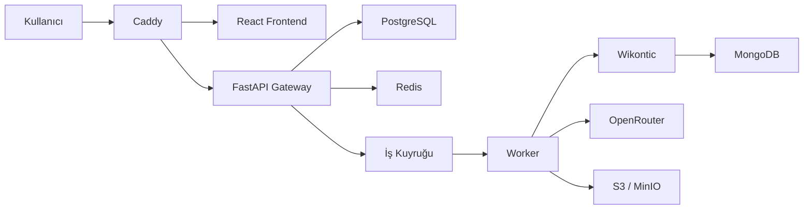

# Knowledge Graph Production

Metin, PDF ve web kaynaklarından bilgi grafiği çıkarmak; üretilen triple'ları RAG ve çoklu model değerlendirmesiyle doğrulamak; doğrulanmış bir triple veri seti oluşturmak için geliştirilen platformdur.

## Mevcut durum

- React frontend Caddy üzerinden çalışıyor.
- FastAPI gateway, frontend API sözleşmesini sağlıyor.
- Wikontic ayrı bir servis olarak çalışıyor.
- OpenRouter üzerinden model çağrısı yapılabiliyor.
- MongoDB Atlas Local üzerinde Wikontic ontology ve embedding indeksleri bulunuyor.
- Extraction job'ları artık ayrı bir Celery worker container'ında, Redis kuyruğu üzerinden asenkron işleniyor.
- Ayrı bir Celery Beat container'ı, kaybolan/takılı kalan job'ları periyodik olarak tarayıp kurtarıyor.
- Docker Compose ile mevcut sistem ayağa kaldırılabiliyor.

## Hedef mimari



Teknoloji kararları:

- Frontend: mevcut React arayüzü
- Reverse proxy: Caddy
- API: FastAPI gateway
- Kalıcı uygulama verileri: PostgreSQL
- Session, rate limit, cache ve queue: Redis
- Ontology ve vector indeksleri: MongoDB
- Dosya deposu: geliştirmede Docker volume, üretimde S3/MinIO
- Worker ve zamanlanmış görevler: Celery ve Celery Beat
- LLM sağlayıcısı: OpenRouter

## Genel TODO

### 1. Kullanıcı girişi ve hesap oluşturma

Platform anonymous-first çalışacaktır. Kullanıcı giriş yapmadan triple çıkarabilecek ve aynı tarayıcıdan döndüğünde çalışma alanını görebilecektir.

- [x] Anonim ziyaretçi cookie'si oluşturma
- [x] Anonim çalışma alanı oluşturma
- [x] Kayıt, giriş, çıkış ve mevcut kullanıcı endpointleri
- [x] E-posta doğrulama (bkz. "Hesap yönetimi genişletmeleri")
- [x] Şifre sıfırlama (bkz. "Hesap yönetimi genişletmeleri")
- [x] Şifreleri Argon2id ile hashleme
- [x] HttpOnly server-side session kullanma
- [x] Anonim geçmişi kayıtlı hesaba aktarma
- [x] Aktif oturumları görüntüleme ve kapatma (bkz. "Hesap yönetimi genişletmeleri")
- [x] Hesap ve kullanıcı verilerini silme (bkz. "Hesap yönetimi genişletmeleri")
- [ ] Google/GitHub OAuth desteğini sonraki sürümde değerlendirme

### 2. Middleware

- [x] Her isteğe request ID verme
- [x] Request ID'yi downstream servislere aktarma
- [x] Güvenli JSON access ve hata logları
- [x] Merkezi ve standart hata cevapları
- [x] API anahtarı, cookie ve doküman içeriğini loglardan temizleme
- [x] Boş veya geçersiz içerikleri reddetme
- [x] Request boyutu sınırı
- [x] Environment tabanlı CORS ve Origin kontrolü
- [x] İmzalı anonim ziyaretçi cookie'si
- [x] Session doğrulama ve kullanıcı context'i
- [x] Güvenli upstream timeout yönetimi
- [x] Redis tabanlı rate limit
- [x] Extraction concurrency limiti (workspace başına maksimum eşzamanlı `queued`/`running` job)
- [x] Hash tabanlı duplicate kontrolü
- [x] Devam eden aynı işlemin tekrar başlatılmasını engelleme
- [x] Unit ve integration testleri

Temel middleware ve rate limit tamamlandı. Duplicate kontrolü doküman ve job modeliyle birlikte eklendi: doküman içeriği SHA-256 ile hashlenip aynı çalışma alanında tekrar kaydedilmiyor, extraction job'ları ise model, KG yöntemi, prompt, embedding modeli, ontology dili ve pipeline sürümünden üretilen bir fingerprint ile eşleşiyor; devam eden veya tamamlanmış aynı iş varsa yeniden kullanılıyor. Aynı anda gelen iki isteğin aynı job'ı iki kez oluşturması, uygulama seviyesindeki kontrole ek olarak `extraction_jobs` tablosundaki kısmi (partial) unique index ile veritabanı seviyesinde de engelleniyor.

### 3. Frontend

Mevcut tasarım korunacak ve yeni backend yeteneklerine bağlanacaktır.

- [x] Anonim oturum göstergesi
- [x] Giriş ve hesap oluşturma ekranları
- [x] Anonim geçmişi hesaba aktarma akışı (giriş yapınca aynı workspace geçmişi otomatik görünür, bkz. "Workspace geçmişi ve triple review")
- [x] Text, PDF ve URL girişi (kaynak türü seçici, PDF yükleme ilerlemesi, ingestion polling, hazır olunca otomatik extraction başlatma, geçmişte PDF sayfa sayısı/URL kaynağı gösterimi — bkz. "Doküman ingestion (PDF/URL)")
- [x] Extraction job durumunu gösterme (doküman → job → polling → triple akışı, bkz. "Frontend async extraction akışı")
- [x] Bekliyor, çalışıyor, tamamlandı ve hata durumları (`queued`/`running` → "Çalışıyor", `completed` → "Hazır", `failed` → "Hata")
- [x] Geçmiş doküman ve extraction listesi (sidebar'daki Geçmiş paneli)
- [x] Triple detay ve kaynak kanıt görünümü (Triple İnceleme penceresi, `char_start`/`char_end` vurgulamalı)
- [ ] RAG doğrulama ve consensus sonuçları
- [x] Triple düzenleme, reddetme ve onaylama
- [ ] Sonuç indirme ve dışa aktarma
- [ ] Kullanım kotası ve model maliyet göstergesi
- [x] Hatalarda request ID gösterme
- [ ] Veri kullanımı ve gizlilik bilgilendirmesi

### 4. Backend

Mevcut gateway korunacak ve modüler bir yapıya ayrılacaktır.

- [x] `auth`, `documents`, `jobs`, `triples` ve `models` route'ları (`models` artık ayrı bir `catalog` modülünde)
- [x] Text, PDF ve URL girişlerini ortak doküman modeline dönüştürme (bkz. "Doküman ingestion (PDF/URL)")
- [x] Doküman hash'i ve pipeline fingerprint üretme
- [x] Extraction job oluşturma
- [x] Job'a tüm pipeline parametrelerini (model, kg_type, prompt_type, embedding_model, ontology_language) ve pipeline_version'ı kaydetme
- [x] Wikontic adapter katmanı
- [x] OpenRouter provider katmanı
- [x] Model ve prompt ayarlarını doğrulama (OpenRouter allow-list + kg_type/prompt_type/embedding_model/ontology_language kombinasyon kontrolü, bkz. "Extraction policy" bölümü)
- [x] Triple ve provenance kaydı
- [x] Candidate, verified ve rejected durumları
- [ ] RAG doğrulama akışı
- [ ] Çoklu model consensus ve final judge
- [ ] Global KG'ye yayınlama kontrolü
- [ ] API sürümleme
- [x] Mevcut senkron `/api/extract` endpoint'i için geçiş dönemi (aynı `extraction` servisini paylaşıyor, frontend job sistemine tam geçene kadar korunuyor)

### 5. Veritabanları

PostgreSQL uygulamanın ana kayıt kaynağı olacaktır. Redis geçici veri ve koordinasyon; MongoDB ise Wikontic ontology ve vector indeksleri için kullanılacaktır.

PostgreSQL tabloları:

- [x] `users`
- [x] `anonymous_visitors`
- [ ] `sessions`
- [x] `workspaces`
- [x] `documents`
- [x] `extraction_jobs`
- [x] `triples`
- [x] `triple_evidence`
- [x] `document_segments`
- [ ] `verification_results`
- [ ] `pipeline_runs`
- [ ] `usage_records`
- [ ] `consent_records`

Altyapı işleri:

- [x] PostgreSQL Docker servisi
- [x] Redis Docker servisi
- [x] Alembic migration sistemi
- [ ] İndeksler ve unique constraint'ler
- [ ] Yedekleme politikası
- [ ] Veri silme ve saklama süreleri
- [ ] MongoDB profil ve index sağlık kontrolleri
- [x] S3/MinIO dosya deposu entegrasyonu (yalnızca PDF binary'leri; bkz. "Doküman ingestion (PDF/URL)")

### 6. Worker ve cron işlemleri

Uzun süren işlemler API container'ında çalıştırılmayacaktır.

Worker kuyrukları:

- [x] `extraction`: triple çıkarma
- [x] `ingestion`: PDF, OCR, scraping ve metin temizleme (bkz. "Doküman ingestion (PDF/URL)")
- [ ] `chunking`: parent-child chunk üretimi
- [ ] `verification`: RAG doğrulama
- [ ] `consensus`: çoklu model değerlendirmesi
- [ ] `publishing`: doğrulanmış triple'ları global KG'ye aktarma

Zamanlanmış görevler:

- [x] Yarım kalan (crash sonrası `running` durumunda takılı kalmış) veya hiç gönderilememiş (`queued` durumunda takılı kalmış) job'ları tespit edip yeniden kuyruğa alma — Celery Beat, bkz. "Job recovery scheduler"
- [x] Başarısız job'ları sınırlı tekrar deneme (hem worker içindeki geçici-hata retry'ı, hem recovery scheduler'ın `JOB_RECOVERY_MAX_ATTEMPTS` sınırı)
- [x] Süresi geçmiş session ve cache kayıtlarını temizleme (anonim ziyaretçi temizliği, bkz. "Bakım cron görevleri")
- [x] Eski geçici dosyaları temizleme (yetim MinIO nesneleri, bkz. "Bakım cron görevleri")
- [ ] OpenRouter model listesini güncelleme (bilinçli olarak elle yönetiliyor — allow-list bir güvenlik/maliyet kontrolü, bkz. "Extraction policy")
- [ ] Kullanım ve maliyet raporları üretme
- [ ] Candidate triple'ları periyodik benchmark'tan geçirme (somut bir kriter/tasarım henüz yok; RAG doğrulama ve consensus aşamalarına ertelendi)
- [x] MongoDB ve embedding profillerinin sağlık kontrolü (bkz. "Bakım cron görevleri")

Her job idempotent olmalıdır. Worker yeniden başlatıldığında aynı model çağrısı gereksiz yere tekrarlanmamalıdır.

## Önerilen geliştirme sırası

1. PostgreSQL ve Redis temeli
2. Temel middleware
3. Anonim ziyaretçi ve kullanıcı oturumları
4. Doküman, job ve triple backend API'leri
5. Worker ve queue sistemi
6. Frontend'in async job sistemine bağlanması
7. Duplicate önleme ve rate limit
8. RAG doğrulama ve çoklu model consensus
9. Cron görevleri, gözlemlenebilirlik ve üretim güvenliği

## Hesap API'si

Platform giriş zorunluluğu olmadan çalışır. İlk API isteğinde imzalı bir `kg_visitor` cookie'si oluşturulur. Kullanıcı kayıt olduğunda bu anonim ziyaretçi kullanıcı hesabına bağlanır ve Redis üzerinde `kg_session` oturumu açılır.

```text
GET  /api/auth/me
POST /api/auth/register
POST /api/auth/login
POST /api/auth/logout
```

Kayıt isteği:

```json
{
  "email": "user@example.com",
  "password": "en-az-10-karakter",
  "display_name": "Kullanıcı Adı"
}
```

Giriş isteği:

```json
{
  "email": "user@example.com",
  "password": "en-az-10-karakter"
}
```

Cookie'ler `HttpOnly` ve `SameSite=Lax` olarak ayarlanır. Üretim ortamında HTTPS kullanın, güçlü bir secret üretin ve aşağıdaki değerleri değiştirin:

```bash
openssl rand -hex 32
```

```env
AUTH_COOKIE_SECRET=uretilen-deger
AUTH_COOKIE_SECURE=true
AUTH_COOKIE_DOMAIN=example.com
```

PostgreSQL şeması backend başlarken Alembic tarafından otomatik uygulanır. Redis yalnızca giriş oturumlarını tutar; anonim ziyaretçi kimliği PostgreSQL'de kalıcıdır.

## Hesap yönetimi genişletmeleri

Temel kayıt/giriş/çıkış akışının üzerine e-posta doğrulama, şifre sıfırlama, aktif oturum yönetimi ve hesap silme eklendi.

```text
POST   /api/auth/email/verification/request   (giriş gerekir)
POST   /api/auth/email/verification/confirm   {token}

POST   /api/auth/password/reset/request       {email}
POST   /api/auth/password/reset/confirm       {token, new_password}

GET    /api/auth/sessions                     (giriş gerekir)
DELETE /api/auth/sessions/{session_id}        (giriş gerekir)
DELETE /api/auth/sessions?include_current=false  (giriş gerekir)

DELETE /api/auth/account                      {password}  (giriş gerekir)
```

**E-posta doğrulama ve şifre sıfırlama** aynı `auth_tokens` tablosunu paylaşır (`purpose`: `email_verification` | `password_reset`). Token'ın yalnızca SHA-256 hash'i saklanır — ham token hiçbir zaman veritabanına yazılmaz. Bir kullanıcının aynı amaç için birden fazla geçerli token'ı olamaz: yeni bir token istendiğinde, aynı amaca ait önceki kullanılmamış token'lar silinir.

**E-posta gönderimi henüz bağlı değil** — `_deliver_email_placeholder` (accounts/routes.py) token'ı gerçek bir e-posta yerine yapılandırılmış bir log satırına yazar (`{"event": "auth_email_placeholder", "purpose": ..., "to_email": ..., "token": ...}`). Bu bilinçli bir geliştirme-aşaması yer tutucusudur; gerçek bir sağlayıcı (SMTP/Resend/SendGrid/vb.) seçilmeden **üretime alınmamalıdır** — aksi halde log erişimi olan biri herhangi bir hesabın şifresini sıfırlayabilir. Şifre sıfırlama isteği, e-posta adresi kayıtlı olsun ya da olmasın her zaman aynı cevabı döner (hesap numaralandırma saldırısını önlemek için).

Bir şifre sıfırlama başarıyla tamamlandığında, o kullanıcının **tüm aktif oturumları** iptal edilir — sıfırlama sızmış kimlik bilgileri yüzünden tetiklendiyse, başka bir yerde oturum açık kalmaya devam etmesi tam olarak kapatılmak istenen risktir.

**Aktif oturumlar**, Redis'te oturum verisiyle birlikte `created_at`/`last_seen_at` taşır ve ayrıca `auth:user_sessions:{user_id}` adında bir Redis set'i üzerinden kullanıcı başına indekslenir (bkz. `accounts/store.py::RedisSessionStore`). Oturum listesinde/API cevabında dönen `id`, ham session cookie değeri değil onun SHA-256 hash'idir — bu id'yi öğrenmek oturumu ele geçirmeye yetmez. `DELETE /api/auth/sessions` varsayılan olarak *mevcut oturum hariç* diğer tüm oturumları kapatır; `?include_current=true` mevcut oturumu da kapatıp session cookie'sini temizler.

**Hesap silme**, şifre doğrulaması ister (401 yanlış şifrede). Kullanıcı satırı silindiğinde, veritabanındaki `ON DELETE CASCADE` zinciri workspace → documents → document_segments/extraction_jobs → triples/triple_evidence'ı otomatik temizler. PDF'lerin MinIO'daki binary'leri bu cascade'e dahil olmadığından, silme öncesi `storage_key`'leri toplanıp veritabanı silme işlemi başarıyla tamamlandıktan **sonra** best-effort olarak MinIO'dan da silinir. Bu sorgu bilinçli olarak `documents` ORM modellerini import etmez — ham SQL (`text()` + tip-güvenli `bindparam`) kullanır; `accounts/` paketinin `documents/` paketine import-zamanlı bağımlı hale gelmesini önlemek için (bkz. "Extraction worker" bölümündeki devre bağımlılığı notu — burada aynı sınıf hatayı ters yönde yeniden yaratmamak amaçlanmıştır). Hesap silindiğinde tüm oturumları da iptal edilir ve session cookie'si temizlenir.

Frontend tarafı: `AuthPanel.jsx`'teki hesap görünümüne e-posta doğrulama (iste + token ile onayla), "Şifremi unuttum" akışı (giriş ekranından erişilir), aktif oturumlar listesi (tek tek veya toplu kapatma) ve "Tehlikeli bölge" içinde şifre onaylı hesap silme eklendi. Gerçek e-posta gönderimi olmadığından, doğrulama/sıfırlama token'ı arayüzde bir metin kutusuna elle girilir (geliştirme ortamında sunucu loglarından okunur).

Ortam değişkenleri (`.env.example`):

```env
EMAIL_VERIFICATION_TTL_SECONDS=86400
PASSWORD_RESET_TTL_SECONDS=3600
```

Testler: `tests/test_account_management.py` (e-posta doğrulama, şifre sıfırlama + oturum iptali, oturum listeleme/tekil-toplu iptal, hesap silme + gerçek cascade doğrulaması — SQLite'ta `PRAGMA foreign_keys=ON` açılarak test edilir, çünkü SQLite bu pragma olmadan `ON DELETE CASCADE`'i sessizce yok sayar — + MinIO temizliği mock'lanarak) ve `tests/test_import_order.py::test_accounts_routes_imports_standalone` (accounts/routes.py'nin documents/'a import-zamanlı bağımlı olmadığının regresyon testi).

## Doküman ve extraction job API'si

Her anonim ziyaretçi veya kullanıcı için otomatik olarak bir çalışma alanı (`workspace`) oluşturulur. Kullanıcı giriş yaptığında, anonim oturumdaki çalışma alanı otomatik olarak hesaba taşınır.

```text
POST /api/documents          (POST /api/documents/text ile aynı, geriye dönük uyumluluk için ikisi de var)
GET  /api/documents
GET  /api/documents/{id}
GET  /api/documents/{id}/ingestion

POST /api/uploads/presign
POST /api/documents/pdf
POST /api/documents/url

POST /api/extraction-jobs
GET  /api/extraction-jobs
GET  /api/extraction-jobs/{id}
```

Doküman oluşturma isteği (düz metin):

```json
{
  "text": "İşlenecek düz metin",
  "title": "Opsiyonel başlık"
}
```

Gönderilen metin normalize edilir (Unicode NFC, satır sonu ve boşluk temizliği) ve SHA-256 ile hashlenir. Aynı çalışma alanında aynı içerik hash'ine sahip bir doküman zaten varsa yeni kayıt açılmaz, mevcut doküman `200` ile döndürülür; yeni bir doküman oluşturulduğunda cevap `201` olur.

PDF ve URL dokümanları da aynı `documents` tablosuna, aynı `source_type`/`ingestion_status` alanlarıyla yazılır — ayrıntılar için "Doküman ingestion (PDF/URL)" bölümüne bakın. Bir dokümanın `ingestion_status`'u `ready` olana kadar o doküman için extraction job açılamaz; deneme `409` ile reddedilir.

Extraction job oluşturma isteği:

```json
{
  "document_id": "...",
  "model": "openrouter/model-id",
  "prompt_type": "temel",
  "kg_type": "wikipedia",
  "embedding_model": "contriever",
  "ontology_language": "en"
}
```

Bu parametrelerden (`kg_type`, `prompt_type`, `embedding_model`, `ontology_language`, `model`, `pipeline_version`) bir pipeline fingerprint üretilir. Aynı doküman için aynı fingerprint'e sahip `queued`, `running` veya `completed` durumunda bir job zaten varsa yeni job açılmaz, mevcut job `200` ile döndürülür; yeni job oluşturulduğunda cevap `201` ve durum `queued` olur. Başarısız (`failed`) job'lar için yeniden deneme yeni bir job kaydı açar.

`extraction_jobs` tablosu, worker'ın işi nasıl çalıştıracağını bilmesi için gönderilen tüm pipeline parametrelerini (`model`, `kg_type`, `prompt_type`, `embedding_model`, `ontology_language`) ve şemadaki `pipeline_version`'ı ayrı sütunlarda saklar; job cevabında bu alanlar da döner. Aynı doküman + aynı fingerprint için aktif (`queued`/`running`) birden fazla job açılmasını, uygulama kontrolüne ek olarak veritabanındaki kısmi unique index kesin olarak engeller; iki eşzamanlı istek çakışırsa ikincisi mevcut job'ı yeniden kullanır.

Job oluşturulduğunda (yeni bir kayıt açıldıysa) job kimliği Celery üzerinden `extraction-worker` container'ına gönderilir; işleme aşağıdaki "Extraction worker" bölümünde anlatılmaktadır.

Job oluşturmadan önce istek "Extraction policy" bölümünde açıklanan kontrollerden geçer: geçersiz `kg_type`/`prompt_type`/`embedding_model`/`ontology_language` veya izin verilmeyen `model` `422` ile, çalışma alanı başına aktif iş limiti aşımı `429` ile reddedilir — bu durumlarda job hiç oluşturulmaz.

`GET /api/extraction-jobs`, çağıran kimliğin (ziyaretçi ya da kullanıcı) çalışma alanına ait job geçmişini döndürür — en yeni önce. Sorgu parametreleri:

```text
?limit=50          # 1-200 arası, varsayılan 50
&offset=0
&status=completed  # queued | running | completed | failed
&document_id=...
```

Cevaptaki her satır (`ExtractionJobSummary`) doküman başlığını, ilk ~200 karakterlik bir önizlemeyi ve o job'a ait triple sayısını içerir; dokümanın tam `raw_text`/`normalized_text` içeriğini **hiçbir zaman** döndürmez — bunun için ayrıca `GET /api/documents/{id}` çağrılmalıdır. Liste her zaman çağıranın kendi çalışma alanına göre filtrelenir; başka bir workspace'in job'ları hiçbir koşulda görünmez.

## Doküman ingestion (PDF/URL)

Text, PDF ve URL kaynaklarının hepsi aynı `documents` / `document_segments` yapısına dönüşür — parent-child chunking ve RAG doğrulama gibi sonraki aşamalar, kaynağın ne olduğundan bağımsız olarak tek bir doküman modeliyle çalışır.

```text
Text  ──────────────────────────────┐
PDF   → presign → MinIO'ya yükleme ─┼─→ Document (pending) ─→ ingestion worker ─→ Document (ready/failed) + document_segments
URL   → SSRF kontrolü ──────────────┘
```

**PDF akışı:**

```text
POST /api/uploads/presign        {filename, content_type} → {upload_url, storage_key, expires_in_seconds}
        ↓ (tarayıcı upload_url'e PUT ile PDF'i doğrudan MinIO'ya yükler — dosya hiçbir zaman backend'den geçmez)
POST /api/documents/pdf          {storage_key, title?} → Document(source_type=pdf, ingestion_status=pending)
        ↓ (worker.ingestion_tasks.ingest_pdf_document Celery'ye gönderilir)
GET /api/documents/{id}/ingestion  (polling)
```

`POST /api/documents/pdf`, `storage_key`'in çağıranın kendi çalışma alanına ait olduğunu (`{workspace_id}/...` öneki) ve MinIO'da gerçekten yüklenmiş, `MAX_PDF_UPLOAD_BYTES`'ı aşmayan bir nesne olduğunu doğrular; aksi halde sırasıyla `403`/`404`/`422` döner.

**URL akışı:**

```text
POST /api/documents/url          {url, title?}
        ↓ (SSRF kontrolü — assert_public_url — herhangi bir DB kaydı açılmadan ÖNCE çalışır)
Document(source_type=url, ingestion_status=pending)
        ↓ (worker.ingestion_tasks.ingest_url_document Celery'ye gönderilir)
GET /api/documents/{id}/ingestion  (polling)
```

Aynı çalışma alanında aynı `url` için zaten `failed` olmayan bir doküman varsa yeniden kullanılır (`200`); yeni oluşturulduğunda `201` ve yalnızca bu durumda yeni bir ingestion job'ı kuyruğa alınır.

`GET /api/documents/{id}/ingestion` cevabı (`DocumentIngestionResponse`): `ingestion_status` (`pending` → `processing` → `ready`/`failed`), `ingestion_error`, `page_count`, `segment_count`.

Mimari notları:

- **PDF binary'si PostgreSQL'e hiç yazılmaz.** Backend yalnızca MinIO'daki nesnenin `storage_key`'ini saklar; tarayıcı presigned URL ile doğrudan MinIO'ya yükler (`storage.py`, `boto3`).
- **Sayfa ve paragraf konumları korunur.** `document_segments` tablosu her sayfa (`segment_type=page`) ve her paragraf (`segment_type=paragraph`) için `page_number` (yalnızca PDF'te; URL paragraflarında `null`), `ordinal`, `char_start`/`char_end` (dokümanın tam metni içindeki mutlak konum) ve `text` saklar — `full_text[char_start:char_end] == text` her zaman doğrudur.
- **Taranmış (metin katmanı olmayan) PDF sayfaları OCR'a düşer.** `pypdf` bir sayfadan metin çıkaramazsa `pdf2image` (poppler) + `pytesseract` (tesseract, `tur`+`eng` dil paketleriyle) o sayfayı görüntüye çevirip OCR'lar. OCR bağımlılıkları (poppler/tesseract) sistemde yoksa veya OCR başarısız olursa sayfa boş metinle devam eder — hiçbir sayfa için istisna fırlatılmaz; yalnızca dokümanın **hiçbir** sayfasından (OCR dahil) metin çıkmazsa doküman `failed` olur.
- **SSRF koruması iki katmanlıdır.** `ingestion/ssrf.py::assert_public_url`, host adını çözüp (`socket.getaddrinfo`) sonuçtaki her IP'nin private/loopback/link-local/reserved/multicast/unspecified olmadığını kontrol eder (RFC 1918, `127.0.0.1`, bulut metadata endpoint'i `169.254.169.254` dahil). Bu kontrol hem ilk istek öncesi hem de **her yönlendirme (redirect) adımından sonra** tekrar çalışır (`ingestion/url_fetch.py`, `httpx` ile manuel — otomatik olmayan — redirect takibi); ilk URL güvenli görünse bile bir redirect iç ağa yönlendirebilir.
- **Boyut ve zaman sınırları.** `MAX_PDF_UPLOAD_BYTES`, `URL_FETCH_TIMEOUT_SECONDS`, `MAX_URL_CONTENT_BYTES` (stream sırasında sayılır, aşılırsa bağlantı hemen kesilir), `MAX_URL_REDIRECTS`.
- **Dosya/URL içeriği magic-byte ile doğrulanır.** PDF metin çıkarma öncesi baytların `%PDF-` ile başladığı kontrol edilir; URL cevabının `content-type`'ı `html`/`text` içermiyorsa (ör. bir PDF veya binary dosyaya yönlendirilmişse) istek reddedilir.
- **Ayrı Celery kuyruğu.** `ingestion-worker` container'ı yalnızca `ingestion` kuyruğunu tüketir (`-Q ingestion`), `extraction-worker`'dan bağımsız ölçeklenir. `worker/ingestion_tasks.py`, extraction worker'la aynı atomik sahiplenme (`pending → processing`, 0 satır etkilenirse no-op) ve sınırlı retry (`INGESTION_MAX_RETRIES`/`INGESTION_RETRY_BACKOFF_SECONDS`) desenini kullanır.
- **Retry'da duplicate segment oluşmaz.** Ingestion tamamlandığında (`_finish_ready`), o dokümana ait önceki `document_segments` satırları silinip yenileri eklenir (`replace_segments_for_document` — extraction worker'ın `replace_triples_for_job`'ıyla aynı sil-ve-yeniden-yaz deseni), bu yüzden bir job kaç kez yeniden denenirse denensin segment çoğalmaz.
- **Aynı içerik iki kez ingest edilmez.** PDF/URL'den çıkarılan nihai metin de düz metin dokümanlarıyla aynı `content_hash` + `(workspace_id, content_hash)` unique index'inden geçer; aynı çalışma alanında aynı içerik hash'ine sahip bir doküman zaten varsa `mark_ingestion_ready` bunu `409` bir `PolicyError`'a çevirir.

Ortam değişkenleri (`.env.example`):

```env
MINIO_PORT=9000
MINIO_CONSOLE_PORT=9001
MINIO_PUBLIC_ENDPOINT=http://localhost:9000
MINIO_ACCESS_KEY=minioadmin
MINIO_SECRET_KEY=minioadmin
MINIO_BUCKET=kg-documents

MAX_PDF_UPLOAD_BYTES=20971520
URL_FETCH_TIMEOUT_SECONDS=15
MAX_URL_CONTENT_BYTES=5242880
MAX_URL_REDIRECTS=5

INGESTION_WORKER_CONCURRENCY=2
INGESTION_MAX_RETRIES=2
INGESTION_RETRY_BACKOFF_SECONDS=20
```

`MINIO_PUBLIC_ENDPOINT`, presigned URL'lerin imzalandığı adrestir ve tarayıcının erişebileceği bir adres olmalıdır — Docker network'ü içindeki `minio:9000` hostname'i tarayıcıdan çözülemez, bu yüzden backend-MinIO iletişimi (`MINIO_ENDPOINT`, varsayılan `http://minio:9000`) ile tarayıcı-MinIO iletişimi (`MINIO_PUBLIC_ENDPOINT`) kasıtlı olarak ayrı tutulur.

Frontend tarafı: `Frontend/src/App.jsx`'teki araştırma metni girişinin üstüne bir kaynak türü seçici (Metin/PDF/URL) eklendi. PDF seçildiğinde dosya seçimi + `XMLHttpRequest` ile yükleme ilerlemesi (fetch'in upload-progress event'i olmadığı için) gösterilir; URL seçildiğinde bir adres girişi sunulur. Her iki durumda da doküman oluşturulduktan sonra `GET /api/documents/{id}/ingestion` 2 saniyede bir poll edilir; durum `ready`'ye geçtiğinde çıkarılan metin araştırma metni alanına yazılır ve ilk extraction job'ı otomatik olarak başlatılır (kullanıcının ayrıca "Karşılaştırma Ekle"ye basmasına gerek kalmaz); `failed` olursa `ingestion_error` inline gösterilir. Sidebar'daki Geçmiş paneli artık her satırda kaynağa göre bir rozet gösterir: PDF için sayfa sayısı, URL için kaynak host adı (`ExtractionJobSummary`'ye eklenen `document_source_type`/`document_page_count`/`document_source_url` alanlarından).

Testler: `tests/test_ssrf.py`, `tests/test_segmentation.py`, `tests/test_pdf_ingestion.py` (gerçek `reportlab` PDF'leriyle metin çıkarma, sayfa/OCR fallback, offset doğrulama), `tests/test_url_ingestion.py` (`httpx.MockTransport` ile redirect/boyut/content-type senaryoları, gerçek `trafilatura` ile ana içerik çıkarma), `tests/test_document_ingestion_endpoints.py` (presign/pdf/url endpoint'leri, ready-gate `409`) ve `Frontend/src/api/extraction.test.js`'e eklenen `presignUpload`/`createPdfDocument`/`createUrlDocument`/`getDocumentIngestion`/`uploadFileToPresignedUrl` testleri.

## Extraction policy

API'ye keyfi bir OpenRouter modeli, pipeline kombinasyonu veya sınırsız sayıda eşzamanlı iş gönderilmesini engelleyen bir koruma katmanı vardır. Bu kontroller hem `POST /api/extract` hem de `POST /api/extraction-jobs` için geçerlidir ve `Backend/gateway/policy.py` + `Backend/gateway/catalog/` içinde toplanmıştır.

Model kataloğu artık ayrı bir modülde:

```text
GET /api/models
```

`allowedOpenroutherLLMModels.json` içindeki liste, izin verilen OpenRouter modellerinin tek doğruluk kaynağıdır (allow-list). Gönderilen `model` bu listede yoksa istek `422` ile reddedilir.

Anonim (giriş yapmamış) ziyaretçiler için ayrıca daha dar bir alt küme uygulanır — maliyet kontrolü amacıyla, kayıtlı kullanıcı olmayan biri yalnızca `ANONYMOUS_MODEL_ALLOWLIST` içindeki modelleri kullanabilir (varsayılan: tek, ucuz bir model). Bu liste her zaman tam kataloğun bir alt kümesidir; env değişkeni yanlışlıkla kataloğa hiç girmemiş bir model id'si içerse bile o id yok sayılır.

Pipeline kombinasyonu doğrulaması:

- `kg_type`: `wikipedia`, `wicontic`, `kggen`
- `prompt_type`: `temel`, `ape`, `dspy`, `textgrad`
- `embedding_model`: `contriever`, `bge_m3`, `turkish_e5_large`, `turkish_sbert_mean_nli_stsb`, `mft_random`
- `ontology_language`: `en`, `tr`

Bu kümelerin dışında bir değer, ya da izin verilmeyen bir `model`, job/extract isteğini `422` ile reddeder — job hiçbir zaman oluşturulmaz.

Metin uzunluğu ve iş kotası:

- `MAX_EXTRACTION_CHARS` (varsayılan `100000`): hem `POST /api/documents` (pydantic `max_length` ile) hem `POST /api/extract` bu sınırı aşan metni `422` ile reddeder.
- `MAX_ACTIVE_JOBS_PER_WORKSPACE` (varsayılan `3`): bir çalışma alanının aynı anda sahip olabileceği `queued`/`running` job sayısının üst sınırıdır. Zaten var olan bir job'ın yeniden kullanılması (dedup) bu sayaca dahil değildir — yalnızca gerçekten yeni bir job açmaya çalışan istekler sayılır ve limit aşıldığında `429` döner. Bu, uygulama seviyesinde bir kontrol say/ekle sırasına dayanır (yarış koşulunda küçük bir toleransla) — kesin bir veritabanı kısıtı değildir; amaç kötüye kullanımı/maliyeti sınırlamaktır, tam bir eşzamanlılık garantisi değildir.

Ortam değişkenleri (`.env.example`):

```env
MAX_EXTRACTION_CHARS=100000
MAX_ACTIVE_JOBS_PER_WORKSPACE=3
ANONYMOUS_MODEL_ALLOWLIST=google/gemini-2.5-flash-lite
```

Testler: `tests/test_policy.py` (allow-list, anonim alt küme, pipeline doğrulama, metin uzunluğu — birim testleri), `tests/test_catalog.py` (`/api/models` sözleşmesi), `tests/test_documents.py` ve `tests/test_api.py` içindeki uçtan uca `422`/`429` senaryoları.

## Triple ve provenance API'si

Bir extraction job tamamlandığında çıkarılan triple'lar `triples` tablosunda, bu triple'ların hangi kaynak metinden geldiği ise `triple_evidence` tablosunda saklanır. Her triple `document_id`, `extraction_job_id` ve `workspace_id` ile ilişkilendirilir; böylece bir triple'ın hangi dokümandan, hangi işten ve hangi çalışma alanından geldiği izlenebilir.

```text
GET   /api/extraction-jobs/{job_id}/triples
GET   /api/triples/{triple_id}
PATCH /api/triples/{triple_id}/status
```

Triple durumları: `candidate` (varsayılan), `verified`, `rejected`. Durum güncelleme isteği:

```json
{
  "status": "verified"
}
```

Triple cevabı, kaynak paragraf/cümle metnini ve doküman içindeki karakter konumunu (`char_start`, `char_end`) içeren bir `evidence` listesi döndürür:

```json
{
  "id": "...",
  "subject": "Atatürk",
  "predicate": "doğum_yeri",
  "object": "Selanik",
  "status": "candidate",
  "evidence": [
    { "source_text": "Atatürk 1881 yılında Selanik'te doğdu.", "char_start": 0, "char_end": 38 }
  ]
}
```

Triple oluşturma genel bir endpoint üzerinden yapılmaz; bunun yerine extraction worker, işi tamamladığında sonuçları doğrudan iç servis katmanı (`triples.service`) üzerinden kaydeder. Tüm triple endpointleri, dokümanlar ve job'larla aynı çalışma alanı (workspace) erişim kontrolüne tabidir; başka bir kullanıcıya/ziyaretçiye ait triple'lara erişim `404` döner.

## Extraction worker

`POST /api/extraction-jobs` ile yeni bir job açıldığında, gateway job kimliğini (yalnızca kimliği — metin veya pipeline parametreleri değil) Redis üzerinden Celery kuyruğuna gönderir. Ayrı bir `extraction-worker` container'ı bu kuyruğu tüketir:

```text
POST /api/extraction-jobs
        ↓
PostgreSQL: queued
        ↓
Redis/Celery kuyruğu (yalnızca job_id taşınır)
        ↓
Worker job'ı atomik olarak sahiplenir (queued → running)
        ↓
extraction.service.run_extraction → Wikontic adapter'ı veya OpenRouter provider'ı çalıştırır
        ↓
Triple + evidence kaydeder (mevcut kayıtların yerine geçer)
        ↓
completed / failed
```

Mimari notları:

- **Ortak extraction servisi.** `extraction/` paketi (`wikontic_adapter.py`, `openrouter_provider.py`, `service.py`) hem senkron `/api/extract` endpoint'i hem de worker tarafından kullanılır; iki kod yolu birbirinden sapmaz. `kg_type=wicontic` Wikontic adapter'ına, `kg_type` `wikipedia`/`kggen` ise OpenRouter provider'ına yönlenir.
- **Atomik sahiplenme.** Worker bir job'ı işlemeden önce `UPDATE extraction_jobs SET status='running' WHERE id=... AND status='queued'` ile atomik olarak sahiplenir. Bu sorgu 0 satır etkilerse (başka bir worker zaten almış ya da job zaten `completed`/`failed`) worker sessizce çıkar — mesaj tekrar teslim edilse bile (Redis'in "en az bir kez teslim" garantisi) job iki kez işlenmez.
- **İdempotent yazım.** Worker sonuçları yazarken o job'a ait önceki triple/evidence kayıtlarını silip yenilerini ekler (`triples.service.replace_triples_for_job`). Bir görev yarıda kalıp yeniden denendiğinde veya mesaj tekrar teslim edildiğinde triple'lar çoğalmaz.
- **Durum geçişleri ve zaman damgaları.** `queued → running → completed` veya `queued → running → failed`. `started_at` sahiplenme anında, `completed_at` sonuç ne olursa olsun (başarı/başarısızlık) yazılır. Başarısızlıkta `error_message` insan tarafından okunabilir, güvenli (iç detay/secret sızdırmayan) bir mesajla doldurulur.
- **Sınırlı retry.** Geçici hatalar (zaman aşımı, 5xx, ağ hatası) `EXTRACTION_JOB_MAX_RETRIES` (varsayılan 3) kez, `EXTRACTION_JOB_RETRY_BACKOFF_SECONDS` (varsayılan 30) bekleme ile tekrar denenir. Kalıcı hatalar (bilinmeyen `kg_type`, 4xx doğrulama hataları) hiç denenmeden `failed` olarak işaretlenir.
- **Broker erişilemezse job kaybolmaz.** Job her zaman önce PostgreSQL'e `queued` olarak yazılır; Celery'ye gönderim (`.delay()`) ayrı bir adımdır ve başarısız olursa (broker geçici olarak erişilemezse) yalnızca loglanır — job satırı `queued` durumda kalıcı olarak durur ve API isteği yine de başarıyla döner. Bu job'lar ve çökmüş worker'lar yüzünden `running`'de takılı kalan job'lar, ayrı bir Celery Beat container'ının periyodik taramasıyla otomatik olarak kurtarılır; bkz. "Job recovery scheduler" bölümü.
- **Concurrency.** Worker container'ı `--concurrency=${CELERY_WORKER_CONCURRENCY:-2}` ile başlar.

Ortam değişkenleri (`.env.example`):

```env
CELERY_WORKER_CONCURRENCY=2
CELERY_TASK_TIME_LIMIT_SECONDS=300
CELERY_TASK_SOFT_TIME_LIMIT_SECONDS=270
EXTRACTION_JOB_MAX_RETRIES=3
EXTRACTION_JOB_RETRY_BACKOFF_SECONDS=30
```

Testler: `tests/test_extraction.py` (adapter/provider/dispatch birim testleri), `tests/test_worker_tasks.py` (Celery `task_always_eager` ile başarı, tekrar teslimde no-op, yarıda kalan işin idempotent yeniden yazımı, kalıcı/geçici hata senaryoları) ve `tests/test_worker_redis_integration.py` (gerçek bir Redis broker'a karşı `celery.contrib.testing.worker.start_worker` ile uçtan uca job teslimi — Redis erişilemezse otomatik `skip` edilir, `REDIS_TEST_URL` ile hedef broker değiştirilebilir).

## Job recovery scheduler

Extraction worker altyapısının kapattığı iki risk hâlâ açıktı: Redis broker geçici olarak kapalıyken oluşturulan bir job'un mesajı hiç yayınlanamayabilir (`queued` durumunda sonsuza dek takılı kalır), ve worker bir job'ı işlerken çökerse job `running` durumunda asılı kalabilir. Ayrı bir `celery-beat` container'ı, periyodik bir tarama görevi (`worker.tasks.recover_stale_jobs`) ile bu iki durumu tespit edip kurtarır:

```text
Celery Beat  (JOB_RECOVERY_SWEEP_SECONDS'te bir tetikler)
    ↓
recover_stale_jobs task'ı  (bir extraction-worker sürecinde çalışır)
    ↓
Stale job taraması (worker/recovery.py::sweep_stale_jobs)
    ├── queued ama QUEUED_JOB_STALE_SECONDS'ten uzun süredir bekliyor → yeniden enqueue
    └── running ama RUNNING_JOB_STALE_SECONDS'ten uzun süredir başlamış → queued'a al → yeniden enqueue
```

Mimari notları:

- **Beat yalnızca zamanlayıcı.** `celery-beat` container'ı veritabanına hiç dokunmaz; sadece `recover_stale_jobs` görevini Redis kuyruğuna belirli aralıklarla yayınlar. Görevin kendisi, normal extraction job'ları gibi mevcut `extraction-worker` süreçlerinden biri tarafından tüketilir ve gerçek veritabanı işini orada yapar.
- **Atomik ve tekilleştirilmiş seçim.** `sweep_stale_jobs`, aday satırları `SELECT ... FOR UPDATE SKIP LOCKED` ile kilitler (`JOB_RECOVERY_BATCH_SIZE` kadar, en eski önce). Aynı anda ikinci bir Beat/worker replikası aynı taramayı çalıştırırsa, kilitli satırları atlar — aynı job iki scheduler tarafından aynı anda kurtarılamaz. (SQLite bu kilidi no-op'a çevirir; birim testleri onun üzerinden çalışır, gerçek kilitleme davranışı ayrı bir PostgreSQL entegrasyon testiyle doğrulanır.)
- **Sınırlı deneme sayısı.** Her job'un kendi `recovery_attempts` sayacı vardır. Bir kurtarma denemesi bu sayacı `JOB_RECOVERY_MAX_ATTEMPTS`'i aşacaksa job yeniden kuyruğa alınmaz; bunun yerine doğrudan `failed` yapılır ve `error_message` alanına güvenli, sabit bir mesaj yazılır — sürekli sorun çıkaran bir job sonsuza dek denenmez.
- **Duplicate triple üretmez.** Kurtarma yalnızca job'un `status`/`started_at` alanlarını sıfırlar; gerçek yeniden işleme, worker'ın zaten idempotent olan `replace_triples_for_job` (sil-ve-yeniden-yaz) akışından geçer, bu yüzden bir job kaç kez kurtarılırsa kurtarılsın triple çoğalmaz.
- **Log korelasyonu.** Her tarama turu bir `sweep_id` (uuid4) üretir; o turda kurtarılan/başarısız sayılan her job, log satırında hem kendi `job_id`'si hem de bu ortak `sweep_id` ile birlikte görünür.
- **Bilinen sınır.** Gerçekten uzun süren meşru bir extraction (ör. çok büyük bir doküman), `RUNNING_JOB_STALE_SECONDS`'i aşarsa yanlışlıkla "çökmüş" sayılıp kurtarılabilir. Varsayılan değer (600 sn) bunu nadir kılacak şekilde seçildi; worker'dan gerçek bir heartbeat sinyali bu sınırı tamamen ortadan kaldırır ama bu görevin kapsamı dışında bırakıldı.

Ortam değişkenleri (`.env.example`):

```env
JOB_RECOVERY_SWEEP_SECONDS=60
QUEUED_JOB_STALE_SECONDS=120
RUNNING_JOB_STALE_SECONDS=600
JOB_RECOVERY_MAX_ATTEMPTS=3
JOB_RECOVERY_BATCH_SIZE=100
```

`extraction_jobs` tablosuna bu özellik için iki sütun eklendi: `recovery_attempts` (kaç kez kurtarılmaya çalışıldığı) ve `last_recovery_at` (son kurtarma denemesinin zamanı — bir sonraki taramanın "ne zamandan beri stale" hesabının referans noktası). Her iki alan da `GET /api/extraction-jobs/{id}` cevabında da döner.

Testler: `tests/test_job_recovery.py` (SQLite birim testleri — taze job'un dokunulmadan kalması, stale queued/running job'ların kurtarılması, max deneme aşımında `failed`'e düşme, batch boyutu sınırı, tamamlanmış/başarısız job'lara dokunulmaması) ve `tests/test_job_recovery_postgres_integration.py` (gerçek PostgreSQL'e karşı — temel kurtarma akışı ve `FOR UPDATE SKIP LOCKED`'ın iki scheduler'ın aynı job'u aynı anda kurtarmasını engellediğinin doğrulanması). PostgreSQL erişilemezse bu testler otomatik `skip` edilir; `POSTGRES_TEST_URL` ile hedef veritabanı değiştirilebilir.

## Bakım cron görevleri

Job recovery scheduler'ın yanına, aynı Celery Beat container'ının tetiklediği üç bakım görevi daha eklendi (`worker/maintenance.py`) — hepsi `extraction-worker` sürecinde çalışır, tıpkı `recover_stale_jobs` gibi:

```text
Celery Beat
    ├── cleanup-stale-anonymous-visitors    (VISITOR_CLEANUP_SWEEP_SECONDS'te bir)
    ├── cleanup-orphaned-storage-objects    (ORPHAN_STORAGE_SWEEP_SECONDS'te bir)
    └── check-wikontic-health               (WIKONTIC_HEALTH_CHECK_SWEEP_SECONDS'te bir)
```

**Süresi geçmiş anonim ziyaretçi temizliği** (`sweep_stale_anonymous_visitors`): hiçbir hesaba bağlanmamış (`claimed_by_user_id IS NULL`) ve imzalı `kg_visitor` çerezinin kendi ömrü (`AUTH_VISITOR_TTL_SECONDS`) kadar süredir görülmemiş `anonymous_visitors` satırlarını siler. Çerez zaten tarayıcıda geçersiz hale geldiği için bu satırın kalmasının bir anlamı yoktur; silindiğinde mevcut `ON DELETE CASCADE` zinciri (bkz. "Hesap yönetimi genişletmeleri") o ziyaretçinin tek başına sahip olduğu workspace/documents/segments/jobs/triples'ı da otomatik temizler. Bir hesaba bağlanmış (`claimed_by_user_id` dolu) ziyaretçi satırları yaşından bağımsız olarak **hiçbir zaman** silinmez — bunlar hesap ile ilk anonim oturum arasındaki kalıcı bağı temsil eder.

**Yetim MinIO nesnesi temizliği** (`sweep_orphaned_storage_objects`): bucket'taki her nesneyi (`storage.iter_objects`) dolaşıp karşılık gelen bir `documents.storage_key` satırı var mı diye bakar; yoksa (tarayıcının presigned URL ile yükleyip hiç `POST /api/documents/pdf` ile onaylamadığı bir yükleme, ya da satırı cascade ile silinmiş bir doküman) nesneyi siler. Yalnızca `ORPHAN_UPLOAD_GRACE_SECONDS`'ten eski nesneler değerlendirilir, böylece yükleme tamamlanıp onay isteği henüz gitmemiş bir nesne yanlışlıkla silinmez. `ingestion_status=failed` bir dokümanın dosyası **silinmez** — satır hâlâ referans veriyor ve bir yeniden deneme aynı dosyaya ihtiyaç duyabilir; bu görev yalnızca hiçbir `Document` satırının artık referans vermediği nesnelerle ilgilenir.

**MongoDB ve embedding profili sağlık kontrolü** (`check_wikontic_health`): wikontic'in `GET /health/ready` (genel Mongo bağlantısı + API anahtarı) ve yeni eklenen `GET /health/profiles` (her yapılandırılmış profil — `WIKONTIC_PROFILES` — için ontology/triplets veritabanlarının var olup olmadığı ve dolu olup olmadığı) endpoint'lerini çağırıp tek bir yapılandırılmış JSON log satırına (`{"event": "wikontic_health_check", "ok": ..., ...}`) özetler. Bu, mevcut `/api/health/ready` gibi yalnızca istek anında değil, **periyodik ve proaktif** çalışır — bir embedding profilinin veritabanı hiç kurulmamışsa veya boşalmışsa, o profili kullanan gerçek bir extraction isteği başarısız olana kadar beklemek yerine loglardan önceden görülebilir.

Ortam değişkenleri (`.env.example`):

```env
VISITOR_CLEANUP_SWEEP_SECONDS=86400
VISITOR_CLEANUP_BATCH_SIZE=500
ORPHAN_STORAGE_SWEEP_SECONDS=21600
ORPHAN_UPLOAD_GRACE_SECONDS=86400
WIKONTIC_HEALTH_CHECK_SWEEP_SECONDS=300
MAINTENANCE_HEALTH_CHECK_TIMEOUT_SECONDS=10
```

Testler: `Backend/gateway/tests/test_maintenance.py` (SQLite birim testleri — stale/claimed/recent ziyaretçi senaryoları, cascade doğrulaması `PRAGMA foreign_keys=ON` ile, yetim/referanslı/grace-period içindeki storage nesneleri, `httpx.MockTransport` ile mock'lanmış wikontic health check senaryoları) ve `Backend/wikontic/tests/test_health_profiles.py` (`/health/profiles` endpoint'i — sahte bir Mongo client ile dolu/boş/eksik veritabanı ve bilinmeyen profil senaryoları). Wikontic'in test paketi bu ortamda çalıştırılamadı (`src.wikontic` paketi import zamanında `transformers`/`torch`'u zorunlu kılıyor, bu sandbox'ta kurulu değil) — gerçek wikontic container'ında/CI'de doğrulanmalı.

## Frontend async extraction akışı

Studio arayüzü artık senkron `/api/extract` yerine doküman/job akışını kullanır (mevcut UI tasarımı ve Türkçe triple alanları — `baş`/`ilişki`/`uç` — değişmedi; sadece veri kaynağı değişti). `Frontend/src/App.jsx` içindeki `handleGraphSend` bir sonuç kartı için şu adımları izler:

```text
POST /api/documents  (metni kaydet)
        ↓
POST /api/extraction-jobs  (job'ı başlat)
        ↓
GET /api/extraction-jobs/{id}  (2.5 sn'de bir poll)
        ↓
queued / running  → kart "Çalışıyor" (loading) gösterir
        ↓
completed         → GET /api/extraction-jobs/{id}/triples çağrılır
        ↓
failed            → hata mesajı + istek kimliği (X-Request-ID) gösterilir
```

İlgili dosyalar:

- `Frontend/src/api/extraction.js` — `createDocument`, `createExtractionJob`, `getExtractionJob`, `getJobTriples`, `getDocument` istemcileri ve backend triple şemasını (`subject`/`predicate`/`object`/`evidence`) mevcut Türkçe UI şemasına (`baş`/`ilişki`/`uç`/`kaynak_cumle`) çeviren `mapTriplesToLegacyFormat`.
- `Frontend/src/api/activeJobsStorage.js` — aktif (henüz `completed`/`failed` olmamış) job kimliklerini `localStorage`'da tutar; sayfa yenilendiğinde `App.jsx`'teki mount effect'i bu kimlikleri okuyup job + doküman durumunu tekrar çekerek kartları geri kurar, terminal duruma ulaşan job'lar listeden otomatik çıkarılır.
- Polling tek bir `setInterval` (2.5 sn) ile yürütülür ve yalnızca `queued`/`running` durumundaki kartları sorgular; `useEffect` temizleme fonksiyonu component unmount olduğunda (sayfadan ayrılınca) interval'ı durdurur.
- Job oluşturma anında zaten `completed`/`failed` dönerse (aynı pipeline için mevcut bir job'un yeniden kullanılması durumunda) sonuç ilk poll turunu beklemeden hemen işlenir.
- Başarısız (`failed`) durumda kart hem `error_message`'ı hem de o anki HTTP cevabının `X-Request-ID` başlığını gösterir.

Testler: `Frontend/src/api/extraction.test.js` (triple eşleme, durum eşleme, süre hesaplama, `buildCardFromJob`, API istemcisi — `fetch` mock'lanarak) ve `Frontend/src/api/activeJobsStorage.test.js` (localStorage kalıcılığı, bozuk veri/geçersiz kayıtlara dayanıklılık). Çalıştırmak için:

```bash
cd Frontend
npm install
npm test
```

## Workspace geçmişi ve triple review

Tamamlanmış job'lar PostgreSQL'de kalıcı olarak durur; sayfa yenilendiğinde (ve daha önce `localStorage`'da hiç iz bırakmamış eski job'lar için de) kullanıcı bunlara sidebar'daki **Geçmiş** panelinden ulaşabilir. Bu panel `GET /api/extraction-jobs` listesini gösterir ve şu durumları ayrı ayrı ele alır:

- **Loading**: `t.historyPanel.loading` metni.
- **Empty**: hiç job yoksa `t.historyPanel.empty`.
- **Error**: istek başarısız olursa hata mesajı + varsa `X-Request-ID` gösterilir; "Yenile" butonu tekrar dener.
- Her satır doküman başlığını/önizlemesini, durumunu (Sırada/Çalışıyor/Tamamlandı/Hata) ve triple sayısını gösterir.

Bir geçmiş satırına tıklamak (`handleSelectHistoryJob` — `App.jsx`), o job'un dokümanını (`GET /api/documents/{id}`) ve — tamamlanmışsa — triple'larını (`GET /api/extraction-jobs/{id}/triples`) çekip mevcut sonuç kartı bileşenini (`ResultCard`) aynı şekilde yeniden oluşturur; en fazla 3 aktif kart sınırı burada da geçerlidir.

Geçmiş, `identity` her değiştiğinde (giriş/çıkış) otomatik olarak yeniden yüklenir. Bunun için herhangi bir özel senkronizasyon gerekmez: backend zaten workspace'i oturum/ziyaretçi çerezinden çözer ve kullanıcı giriş yaptığında ziyaretçinin çalışma alanını hesaba taşır (bkz. "Doküman ve extraction job API'si"), dolayısıyla aynı `GET /api/extraction-jobs` isteği artık aynı geçmişi yeni kimlik altında döndürür — anonim geçmiş kaybolmaz.

Tamamlanmış bir kartın başlığındaki onay ikonu **Triple İnceleme** penceresini açar (`TripleReviewModal.jsx`):

- Sol sütun: job'un tüm triple'ları, durum rozetleriyle (Aday/Onaylandı/Reddedildi) birlikte.
- Sağ sütun: seçili triple'ın kaynak kanıtları — dokümanın tam metni içinde, triple'ın `char_start`/`char_end` aralığı `<mark>` ile vurgulanarak gösterilir.
- Her triple için üç aksiyon: **Onayla** (`PATCH .../status` → `verified`), **Reddet** (→ `rejected`), **Geri al** (→ `candidate`). Güncelleme başarılı olduğunda kartın hem `rawTriples`'ı hem de KG grafiğinde kullanılan eşlenmiş `triplets`'ı yerinde güncellenir; başarısız olursa modalde bir hata mesajı gösterilir.

## Middleware davranışı

Gateway bütün API isteklerine bir `X-Request-ID` verir ve bu kimliği Wikontic çağrılarına aktarır. Hata cevapları aynı sözleşmeyi kullanır:

```json
{
  "detail": "İnsan tarafından okunabilir açıklama",
  "error": {
    "code": "VALIDATION_ERROR",
    "request_id": "req_..."
  }
}
```

Middleware şu kontrolleri gateway seviyesinde uygular:

- JSON access/error logları; cookie, API anahtarı ve istek gövdesi loglanmaz.
- İzin verilen origin, JSON content type ve maksimum istek boyutu kontrolü.
- Redis üzerinde IP bazlı, sabit zaman pencereli genel API, auth ve extraction limitleri.
- `RateLimit-Limit`, `RateLimit-Remaining`, `RateLimit-Reset` ve gerektiğinde `Retry-After` başlıkları.
- Redis rate limit servisi kullanılamıyorsa korunan endpoint için güvenli `503` cevabı.
- Upstream bağlantı ve zaman aşımı hatalarında iç ayrıntıları gizleyen `502/504` cevapları.

Yerel varsayılanlar `.env.example` içindedir. Üretimde en az aşağıdaki değerleri ortama göre değiştirin:

```env
ALLOWED_ORIGINS=https://uygulama.example.com
MAX_REQUEST_BYTES=2097152
TRUST_PROXY_HEADERS=true
LOG_HASH_SALT=uzun-rastgele-bir-deger
RATE_LIMIT_ENABLED=true
RATE_LIMIT_WINDOW_SECONDS=60
RATE_LIMIT_GENERAL_REQUESTS=120
RATE_LIMIT_AUTH_REQUESTS=10
RATE_LIMIT_EXTRACT_REQUESTS=10
```

`TRUST_PROXY_HEADERS=true` yalnızca backend doğrudan internete açılmadığında ve istekler güvenilen Caddy katmanından geçtiğinde kullanılmalıdır.

## Çalıştırma

Gerekenler: Docker Desktop ve OpenRouter API anahtarı.

İlk kurulum:

```bash
cp .env.example .env
```

`.env` dosyasına OpenRouter anahtarını yazın:

```env
OPENROUTER_API_KEY=your_api_key
```

RAG verilerini bir kez hazırlayın:

```bash
docker compose --profile setup run --rm wikontic-init
```

Frontend ve backend servislerini başlatın:

```bash
docker compose up -d --build
```

Uygulama adresi: http://localhost:3000

Servisleri durdurun:

```bash
docker compose down
```

Sonraki çalıştırmalarda:

```bash
docker compose up -d
```
